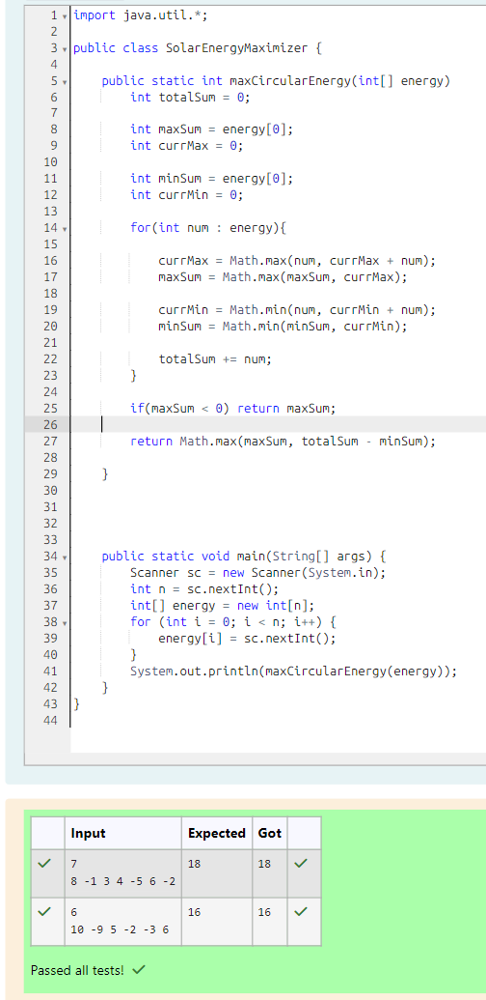

# EX 4A Kadane's Algorithm - Dynamic Programming. 

## AIM:
To Write a Java program to solve the below problem using Kadane's Algorithm.
A solar company installs solar panels around a circular grid of n buildings. Each building either generates or consumes net energy, represented by integers (+ve for generated, -ve for consumed).

The company wants to find a contiguous sequence of buildings (possibly wrapping around from the end to the beginning) that maximizes the total net energy.

Write a program to compute the maximum net energy that can be collected from any contiguous block of buildings on the circular grid.

Input Format:
First line: Integer n (number of buildings)

Second line: n space-separated integers: net energy for each building

Output Format:
A single integer: Maximum net energy collectable from a contiguous block (wrapping allowed)

Constraints:
1 <= n <= 10^6

## Algorithm
1. Read the number of elements and the array values from the user.

2. Initialize variables:
   - totalSum to store sum of all elements
   - currMax and maxSum for maximum subarray sum (Kadane’s algorithm)
   - currMin and minSum for minimum subarray sum

3. Traverse the array:
   - Update currMax = max(num, currMax + num) and maxSum accordingly
   - Update currMin = min(num, currMin + num) and minSum accordingly
   - Add each element to totalSum

4. If all elements are negative, return maxSum (largest element).

5. Otherwise, return the maximum of:
   - maxSum (normal subarray)
   - totalSum - minSum (circular subarray)  

## Program:
```java
/*
Program to find the maximum circular subarray sum using Kadane’s algorithm
Developed by: Junaid Sardar S
Register Number: 212224100028
*/

import java.util.*;
public class SolarEnergyMaximizer {
    public static int maxCircularEnergy(int[] energy)     {
        int totalSum = 0;
        int maxSum = energy[0];
        int currMax = 0;
        int minSum = energy[0];
        int currMin = 0;
        for(int num : energy){
            currMax = Math.max(num, currMax + num);
            maxSum = Math.max(maxSum, currMax);
            currMin = Math.min(num, currMin + num);
            minSum = Math.min(minSum, currMin);
            totalSum += num;
        }
        if(maxSum < 0) return maxSum;
        return Math.max(maxSum, totalSum - minSum);

    }
    public static void main(String[] args) {
        Scanner sc = new Scanner(System.in);
        int n = sc.nextInt();
        int[] energy = new int[n];
        for (int i = 0; i < n; i++) {
            energy[i] = sc.nextInt();
        }
        System.out.println(maxCircularEnergy(energy));
    }
}
```

## Output:


## Result:
The program successfully Implemented and the output is verified. 
