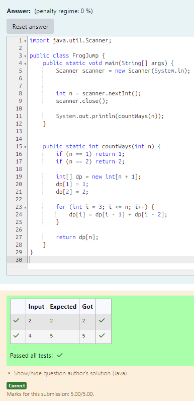

# EX 4B Frog Jump - Dynamic Programming.

## AIM:
To write a Java program to for given constraints.
A Frog Jump 1 or 2 steps at a time.
Problem Statement:

A frog is at the bottom of the stairs with n steps. It can jump either 1 or 2 steps at a time. Write a program to find the number of distinct ways the frog can reach the top (n-th step).

Input Format:

A single integer n (1 ≤ n ≤ 45) – number of steps.
 Output Format:

A single integer – number of distinct ways to reach step n.

## Algorithm
1. Read the number of steps (n) from the user.

2. Handle base cases:
   - If n = 1, return 1
   - If n = 2, return 2

3. Initialize a DP array of size (n + 1):
   - Set dp[1] = 1 and dp[2] = 2

4. Fill the DP array using the relation:
   - dp[i] = dp[i - 1] + dp[i - 2]

5. Return dp[n], which gives the total number of ways to reach the top.

## Program:
```java
/*
Program to find the number of ways a frog can reach the top using dynamic programming
Developed by: Junaid Sardar S
Register Number: 212224100028
*/

import java.util.Scanner;
public class FrogJump {
    public static void main(String[] args) {
        Scanner scanner = new Scanner(System.in);
        int n = scanner.nextInt();
        scanner.close();
        System.out.println(countWays(n));
    }
    public static int countWays(int n) {
        if (n == 1) return 1;
        if (n == 2) return 2;
        int[] dp = new int[n + 1];
        dp[1] = 1;
        dp[2] = 2;
        for (int i = 3; i <= n; i++) {
            dp[i] = dp[i - 1] + dp[i - 2];
        }
        return dp[n];
    }
}
```

## Output:


## Result:
The program successfully implemented and the expected output is verified.
