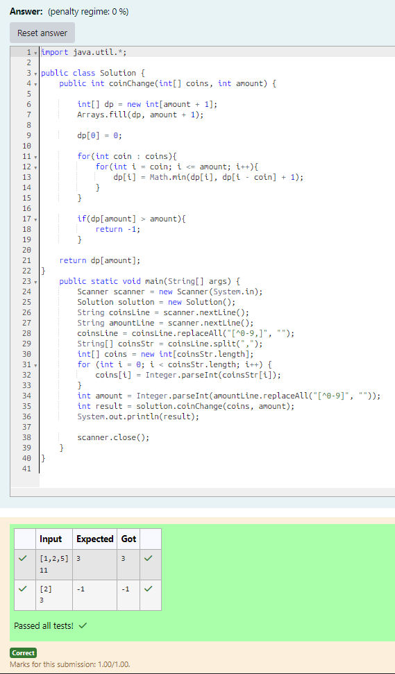

# EX 4C Coin Change Problem - Dynamic Programming.

## AIM:
To write a Java program to for given constraints.
You are given an integer array coins representing coins of different denominations and an integer amount representing a total amount of money.

Return the fewest number of coins that you need to make up that amount. If that amount of money cannot be made up by any combination of the coins, return -1.

You may assume that you have an infinite number of each kind of coin.

## Algorithm
1. Read the coin denominations and the target amount from the user.

2. Initialize a DP array of size (amount + 1):
   - Fill with a large value (amount + 1) to represent unreachable states.
   - Set dp[0] = 0 (base case).

3. For each coin in the given coins:
   - Traverse from coin value to amount.
   - Update dp[i] = min(dp[i], dp[i - coin] + 1).

4. After filling the DP array:
   - If dp[amount] is still greater than amount, return -1 (not possible).

5. Otherwise, return dp[amount] as the minimum number of coins required. 

## Program:
```java
/*
Program to find the minimum number of coins required to make a given amount using dynamic programming
Developed by: Junaid Sardar S
Register Number: 212224100028
*/

import java.util.*;
public class Solution {
    public int coinChange(int[] coins, int amount) {
        int[] dp = new int[amount + 1];
        Arrays.fill(dp, amount + 1);
        dp[0] = 0;
        for(int coin : coins){
            for(int i = coin; i <= amount; i++){
                dp[i] = Math.min(dp[i], dp[i - coin] + 1);
            }
        }
        if(dp[amount] > amount){
            return -1;
        }
    return dp[amount];
}
    public static void main(String[] args) {
        Scanner scanner = new Scanner(System.in);
        Solution solution = new Solution();
        String coinsLine = scanner.nextLine(); 
        String amountLine = scanner.nextLine();
        coinsLine = coinsLine.replaceAll("[^0-9,]", ""); 
        String[] coinsStr = coinsLine.split(",");
        int[] coins = new int[coinsStr.length];
        for (int i = 0; i < coinsStr.length; i++) {
            coins[i] = Integer.parseInt(coinsStr[i]);
        }
        int amount = Integer.parseInt(amountLine.replaceAll("[^0-9]", ""));
        int result = solution.coinChange(coins, amount);
        System.out.println(result);

        scanner.close();
    }
}
```

## Output:


## Result:
The program successfully implemented and the expected output is verified.
