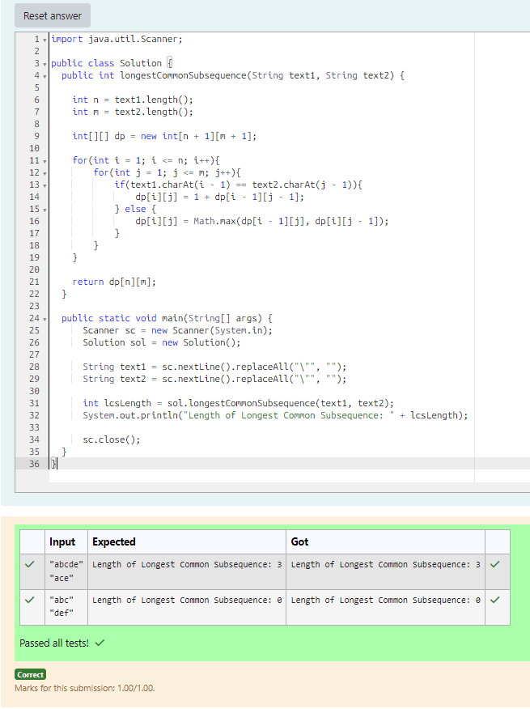

# EX 4D Longest Common SubSequence - Dynamic Programming.

## AIM:
To write a Java program to for given constraints.
Given two strings text1 and text2, return the length of their longest common subsequence. If there is no common subsequence, return 0.
A subsequence of a string is a new string generated from the original string with some characters (can be none) deleted without changing the relative order of the remaining characters.

For example, "ace" is a subsequence of "abcde".
A common subsequence of two strings is a subsequence that is common to both strings.

Input: text1 = "abcde", text2 = "ace" 
Output: 3  
Explanation: The longest common subsequence is "ace" and its length is 3.
Constraints:

1 <= text1.length, text2.length <= 1000
text1 and text2 consist of only lowercase English characters.

## Algorithm
1. Read two input strings from the user.

2. Initialize a 2D DP array of size (n+1) × (m+1), where n and m are lengths of the two strings.

3. Traverse both strings using nested loops:
   - If characters match, set dp[i][j] = 1 + dp[i-1][j-1]
   - Else, set dp[i][j] = max(dp[i-1][j], dp[i][j-1])

4. Continue filling the DP table until all subproblems are solved.

5. The value at dp[n][m] gives the length of the longest common subsequence.  

## Program:
```java
/*
Program to find the length of the longest common subsequence using dynamic programming
Developed by: Junaid Sardar S
Register Number: 212224100028
*/

import java.util.Scanner;
public class Solution {
  public int longestCommonSubsequence(String text1, String text2) {    
    int n = text1.length();
    int m = text2.length();
    int[][] dp = new int[n + 1][m + 1];
    for(int i = 1; i <= n; i++){
        for(int j = 1; j <= m; j++){
            if(text1.charAt(i - 1) == text2.charAt(j - 1)){
                dp[i][j] = 1 + dp[i - 1][j - 1];
            } else {
                dp[i][j] = Math.max(dp[i - 1][j], dp[i][j - 1]);
            }
        }
    }
    return dp[n][m];
  }
  public static void main(String[] args) {
      Scanner sc = new Scanner(System.in);
      Solution sol = new Solution();
      String text1 = sc.nextLine().replaceAll("\"", "");
      String text2 = sc.nextLine().replaceAll("\"", "");
      int lcsLength = sol.longestCommonSubsequence(text1, text2);
      System.out.println("Length of Longest Common Subsequence: " + lcsLength);
      sc.close();
  }
}
```

## Output:


## Result:
The program successfully implemented and the expected output is verified.
