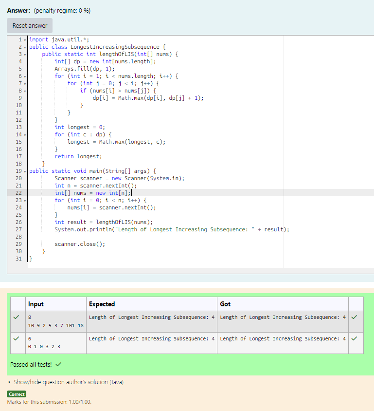

# EX 4E Longest Increasing Subsequence - Dynamic Programming.

## AIM:
To write a Java program to for given constraints.
Given an integer array nums, return the length of the longest strictly increasing subsequence.
Example 1:
Input: nums = [10,9,2,5,3,7,101,18]
Output: 4
Explanation: The longest increasing subsequence is [2,3,7,101], therefore the length is 4.

## Algorithm
1. Read the number of elements and the array values from the user.

2. Initialize a DP array of size n, where each element is set to 1 (each element itself is a subsequence).

3. For each element from index 1 to n-1:
   - Compare it with all previous elements.
   - If nums[i] > nums[j], update dp[i] = max(dp[i], dp[j] + 1).

4. After filling the DP array, find the maximum value in dp[].

5. Return this maximum value as the length of the longest increasing subsequence.

## Program:
```java
/*
Program to find the length of the longest increasing subsequence using dynamic programming
Developed by: Junaid Sardar S
Register Number: 212224100028
*/

import java.util.*;
public class LongestIncreasingSubsequence {
    public static int lengthOfLIS(int[] nums) {
        int[] dp = new int[nums.length];
        Arrays.fill(dp, 1);
        for (int i = 1; i < nums.length; i++) {
            for (int j = 0; j < i; j++) {
                if (nums[i] > nums[j]) {
                    dp[i] = Math.max(dp[i], dp[j] + 1);
                }
            }
        }
        int longest = 0;
        for (int c : dp) {
            longest = Math.max(longest, c);
        }
        return longest;
    }
public static void main(String[] args) {
        Scanner scanner = new Scanner(System.in);
        int n = scanner.nextInt();
        int[] nums = new int[n];
        for (int i = 0; i < n; i++) {
            nums[i] = scanner.nextInt();
        }
        int result = lengthOfLIS(nums);
        System.out.println("Length of Longest Increasing Subsequence: " + result);

        scanner.close();
    }
}
```

## Output:


## Result:
The program successfully implemented and the expected output is verified.
